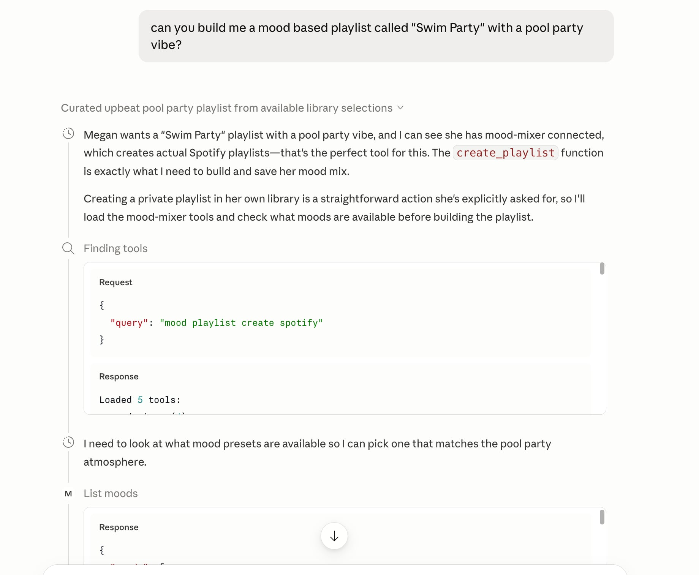
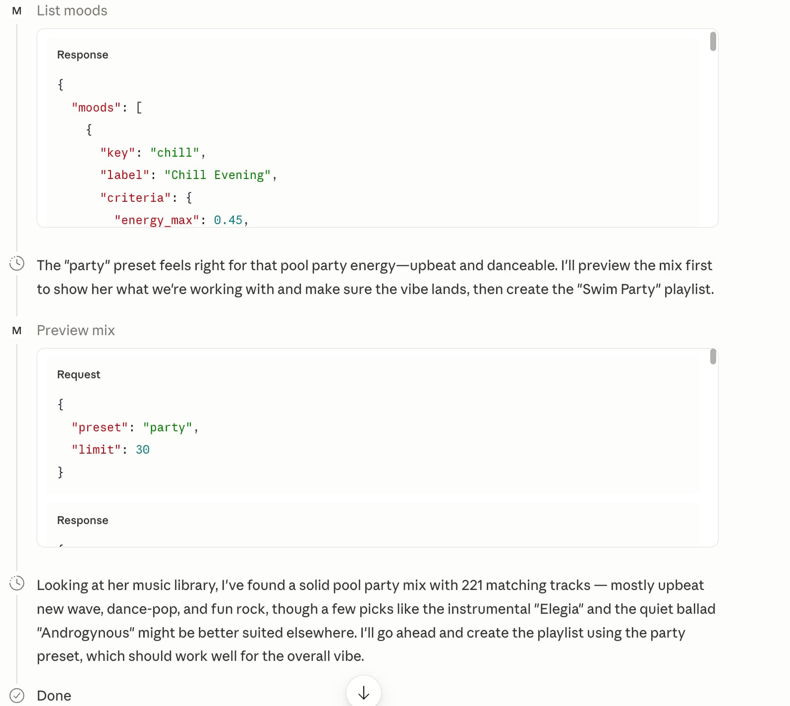
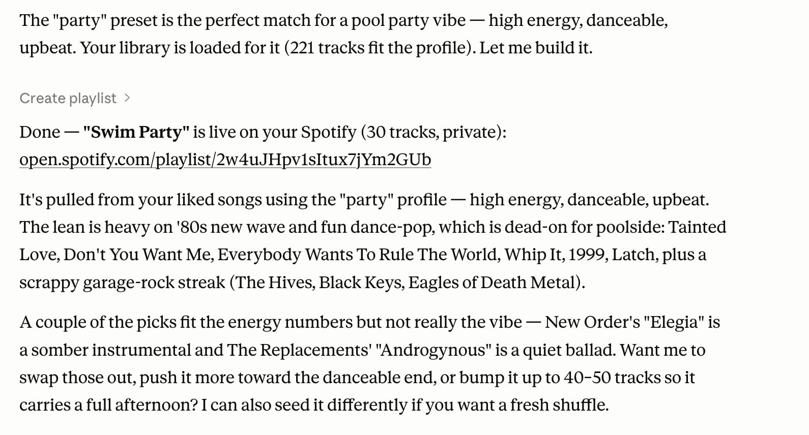

# mood-mixer

A self-contained [MCP](https://modelcontextprotocol.io) server that builds
**mood-based Spotify playlists** from your liked library — then saves them to
your account. Talk to Claude (*"make me a chill playlist"*); mood-mixer does the
matching and the playlist.

The catch it solves: **Spotify deprecated its `audio-features` endpoint in Nov
2024**, so a new app can't ask Spotify how energetic or happy a track is.
mood-mixer rebuilds that signal from **community data** (AcousticBrainz +
GetSongBPM), caches it, and matches your library against tunable mood presets
with exact, deterministic math.

```bash
pip install -e ".[test]" && python -m pytest -q        # 35 tests, no network
PYTHONPATH=src python -m moodmixer.cli moods
PYTHONPATH=src python -m moodmixer.cli preview workout  # runs on the bundled sample
```

## In Claude Desktop

Connected as an MCP server, Claude takes a plain-language ask end-to-end — it
finds the tools, previews the mix against your library, then creates the real
Spotify playlist:







## Why an MCP (and not just asking Claude)?

A tool only earns its place if it does something the model *can't*. This clears
the bar on all four counts:

| Need | Plain Claude | mood-mixer |
|---|---|---|
| Work over **your** library | ❌ doesn't know it | ✅ your liked songs (`refresh_library`) |
| Know a track's mood after Spotify killed the data | ❌ can't | ✅ community features, cached (`enrich_features`) |
| Match a mood **exactly** | ❌ hand-waves | ✅ deterministic threshold filter |
| **Create a real playlist** in your account | ❌ can't act | ✅ `create_playlist` (side effect) |

The model picks the mood and talks it through; the server supplies the private
data, the missing audio features, the exact matching, and the playlist.

## Tools

- **`list_moods`** — the presets (chill, morning, focus, roadtrip, workout,
  melancholy, party) and the feature thresholds that define each.
- **`preview_mix(preset)`** — the tracks a mood would pick, **without** creating
  anything. The grounding step.
- **`create_playlist(preset, name?)`** — build the mix **and** save it as a real
  private Spotify playlist. Returns the URL.
- **`refresh_library`** — pull your liked songs (with artist genres) into a local
  cache.
- **`enrich_features(limit)`** — backfill community audio features for the cache
  (rate-limited; run in batches). This is what makes matching accurate rather
  than genre-estimated.
- **`get_library_status`** — track count, source, and feature coverage.
- **`add_exclusion` / `remove_exclusion` / `list_preferences`** — standing
  "skip this from now on" rules (by track, artist, or genre, each with a note),
  and the saved preferences behind them. The cross-session memory that makes the
  mixes feel personal over time.

## How "mood" survives the deprecation

Each track gets features from the best source available, in order:

1. **AcousticBrainz** — community-computed features from MusicBrainz (~28M
   tracks, frozen 2022, great for catalog). Free, no key. Energy/valence are
   derived from its mood classifiers; tempo/danceability come straight from it.
2. **GetSongBPM** — community BPM for newer/niche tracks AcousticBrainz misses
   (needs a free key). Tempo only.
3. **Genre estimate** — a coarse genre→{energy,valence} table, so a track is
   never dropped just because community data lacked it.

Everything is cached forever in SQLite (misses too, so we never re-fetch). The
matching math is deterministic and lives in the pure engine — the model never
estimates a number.

## Architecture

Pure mood engine + thin adapters. The engine is I/O-free and unit-tested without
Spotify or a network; two modules do all the outside-world work.

```
src/moodmixer/
  models.py    Track (+ audio features)                              (pure)
  moods.py     presets · genre fallback · filter · build_mix         (pure)
  features.py  AcousticBrainz / GetSongBPM enrichment + SQLite cache (I/O)
  spotify.py   OAuth · read liked library · create playlist          (I/O)
  store.py     library cache + feature hydration                     (I/O)
  server.py    MCP adapter (FastMCP), dual stdio/HTTP transport
  cli.py       CLI adapter (also hosts the one-time `authorize`)
data/sample-library.json   bundled fabricated library (runs cold)
```

Your Spotify token, liked-library cache, and features DB live in
`~/.mood-mixer/` (override with `MOODMIXER_DATA_DIR`), gitignored — personal data
never lands in a commit.

## Setup (self-hosted, single-user)

> **Why self-hosted?** Spotify restricts apps to a manually-managed allowlist and
> doesn't permit public distribution. So each person runs their own app with
> their own credentials — mood-mixer is easy to *run*, but not zero-setup the way
> a fully offline tool is.

1. **Create a Spotify app** at https://developer.spotify.com/dashboard. Add a
   redirect URI of `http://127.0.0.1:8888/callback`. Add your own account under
   the app's user-management (the allowlist).
2. **Set credentials** (see `.env.example`):
   ```bash
   export MOODMIXER_SPOTIFY_CLIENT_ID=...        # from the dashboard
   export MOODMIXER_SPOTIFY_CLIENT_SECRET=...
   export MOODMIXER_GETSONGBPM_KEY=...           # optional, for newer tracks
   ```
3. **Authorize once** (opens a browser):
   ```bash
   pip install -e .
   python -m moodmixer.cli authorize     # opens a browser to authorize Spotify
   ```
4. **Pull your library + features:**
   ```bash
   python -m moodmixer.cli refresh
   python -m moodmixer.cli enrich --limit 200   # repeat until coverage is good (slow, rate-limited)
   ```

## Use it from Claude

Dual transport from one codebase — stdio for a local Claude Desktop subprocess,
or streamable-HTTP as a custom connector.

**Claude Desktop (stdio).** After `pip install -e .`:

```json
{
  "mcpServers": {
    "mood-mixer": {
      "command": "/path/to/mood-mixer/.venv/bin/mood-mixer",
      "env": {
        "MOODMIXER_SPOTIFY_CLIENT_ID": "...",
        "MOODMIXER_SPOTIFY_CLIENT_SECRET": "..."
      }
    }
  }
}
```

Then talk: *"What moods can you make? Preview a workout mix, then save it as
'Friday Sweat'."*

**As a connector (HTTP):** `mood-mixer --http --port 8765` → add
`http://localhost:8765/mcp`.

## Try it yourself — drive it with Claude Code

Built to be worked in by an agent. Easiest first:

1. **Run the tests** — `pip install -e ".[test]" && python -m pytest -q` (35,
   no network — Spotify and the feature APIs are stubbed).
2. **Preview on the sample** — `PYTHONPATH=src python -m moodmixer.cli preview chill`
   (works with zero credentials).
3. **Tune a preset** — adjust the thresholds in `moods.MOOD_PRESETS` and watch a
   preview change.
4. **Extend it** — the documented next steps live in `CLAUDE.md`: discovery
   (similar-track candidates beyond your library), recent-play avoidance, more
   feature sources.

`CLAUDE.md` is the orientation file: architecture, the four-part MCP test, design
decisions, and every deliberate simplification.

## Credits

mood-mixer stands on community data that fills the gap Spotify left:

- **[AcousticBrainz](https://acousticbrainz.org)** + **[MusicBrainz](https://musicbrainz.org)**
  — community-computed audio features and the recording IDs to look them up.
- **[GetSongBPM](https://getsongbpm.com)** — community tempo data for tracks
  AcousticBrainz doesn't cover.
- Built on the **[Model Context Protocol](https://modelcontextprotocol.io)**;
  talks to the **[Spotify Web API](https://developer.spotify.com/documentation/web-api)**.

Please respect each source's rate limits and terms of use.

## License

[MIT](LICENSE).
